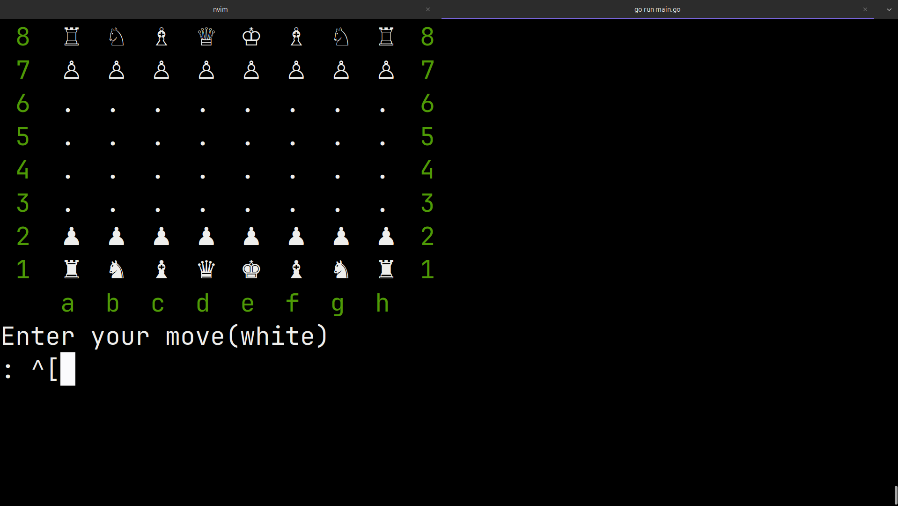
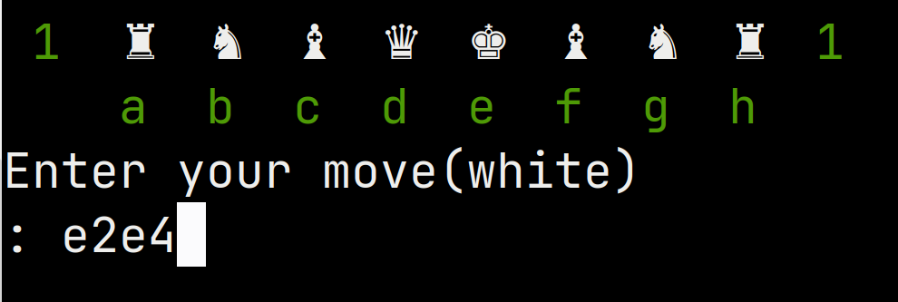
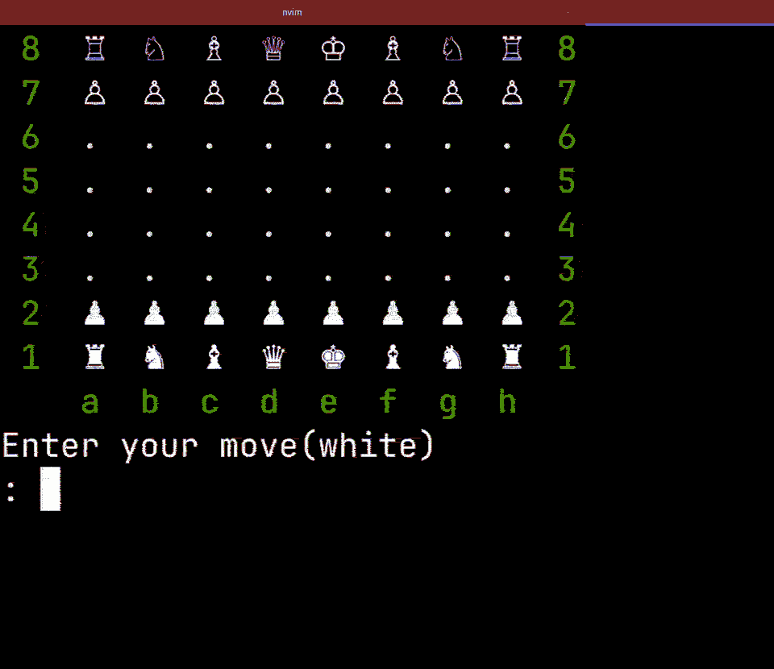
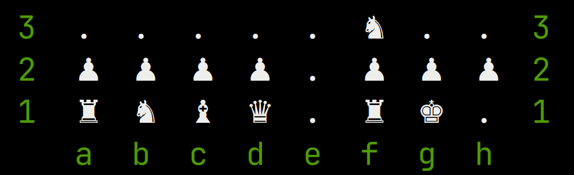
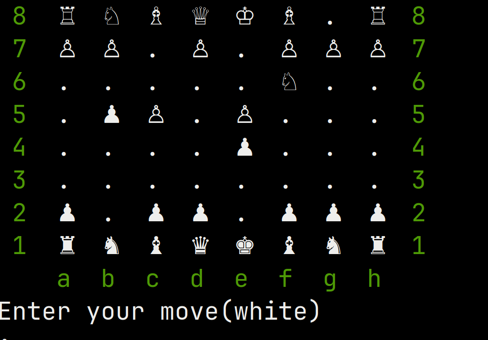
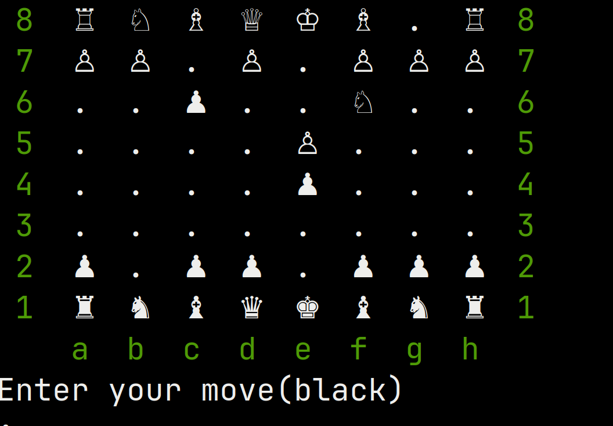

# chess_v1

A chess engine built in Go, runs in your terminal. Started from scratch — bare board, no moves, nothing. Grew it piece by piece until it could play a real game of chess.

---

## How it looks



---

## What it supports

- All standard piece moves — pawns, knights, bishops, rooks, queens, kings
- Pawn captures, including **en passant**
- **Castling** — both king side and queen side, for both colors
- Capturing pieces
- Turn enforcement — white goes first, then black, back and forth
- **Check detection** — illegal moves that leave your king in check are blocked
- **Checkmate and stalemate detection** — still being worked on, but the foundation is there

---

## How to run it

```bash
go run main.go
```

Then just type moves in the format `e2e4` — from square to square.

---

## How moves work





---

## Castling



Castling rights are tracked throughout the game. If you move your king or either rook, you lose the right to castle on that side. Works for both colors.

---

## En passant





The en passant square is tracked after every pawn double push and cleared after the next move if it wasn't taken.

---

The goal was always to keep it dependency free and build everything from scratch — the board, the move logic, the state tracking, all of it.
